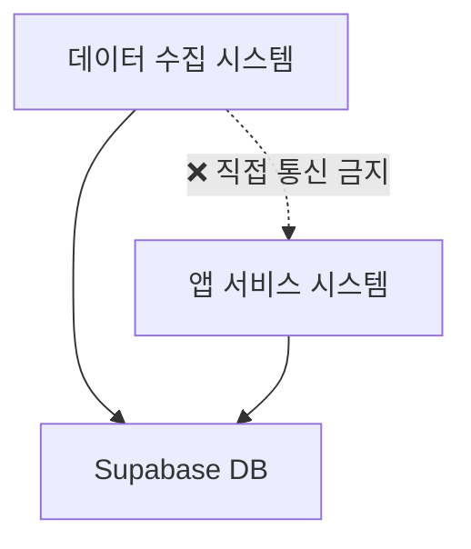

# 응답: Task 1 아키텍처 표준 기반 구축 완료

**응답자**: Standards Guardian  
**응답일**: 2025-01-21  
**요청 ID**: 002-task1-architecture-standards-foundation.md  
**상태**: ✅ **완료**

---

## 📋 작업 완료 요약

PM의 긴급 요청에 따라 **Task 1 수행을 위한 전체 아키텍처 표준**을 정의하고 문서화했습니다.

### 🎯 완료된 산출물 (100%)

1. **✅ 아키텍처 가이드** - `.claude/contracts/standards/architecture-guide.md`
   - 분리 아키텍처 원칙 및 시스템 구조 정의
   - 데이터 흐름 및 장애 격리 전략
   - 성능 요구사항 명시

2. **✅ API 설계 표준** - `.claude/contracts/standards/api-standards.md`
   - Next.js App Router 전용 표준
   - 표준 API 응답 형식 정의
   - 인증/권한 및 에러 처리 규칙

3. **✅ 코딩 스타일 가이드** - `.claude/contracts/standards/coding-style.md`
   - 파일 명명 규칙 (Backend/Frontend)
   - Git 브랜치 전략 및 커밋 메시지 규칙
   - ESLint/Prettier 설정 표준

4. **✅ 보안 가이드라인** - `.claude/contracts/standards/security-guide.md`
   - JWT 토큰 보안 표준 (1시간 만료, 32자+ 시크릿)
   - 데이터 보호 및 암호화 정책
   - API 보안 및 클라이언트 보안 규칙

5. **✅ 코드 리뷰 체크리스트** - `.claude/contracts/standards/review-checklist.md`
   - 아키텍처/품질/보안/성능 검토 기준
   - Pull Request 프로세스 및 승인 규칙
   - Standards Guardian 거부권 행사 기준

---

## 🏗️ 주요 표준 정의 내용

### 1. **분리 아키텍처 원칙** (Core Architecture)

- **물리적/논리적 완전 분리**: 독립 서버, 독립 코드베이스, 독립 배포
- **장애 격리**: 한 시스템 장애가 다른 시스템에 영향 없음
- **데이터 동기화**: Supabase를 통한 간접 통신만 허용

### 2. **Next.js App Router 강제 표준**
```typescript
// ✅ 필수 구조
app/api/v1/{resource}/{action}/route.ts

// 🚫 금지 패턴  
pages/api/                    // Pages Router 사용 금지
getServerSideProps()          // 사용 금지
```

### 3. **Flutter Clean Architecture**
```dart
lib/features/{feature}/
├── data/          // Repository 구현, API 호출
├── domain/        // Entity, Repository 인터페이스, UseCase
└── presentation/  // UI, State Management (Riverpod)
```

### 4. **보안 표준 (강화됨)**
- **JWT 토큰**: 1시간 만료, 32자+ 시크릿, 토큰 회전
- **패스워드**: bcrypt 12라운드, 복잡도 규칙 강제
- **API 보안**: HTTPS 강제, Rate Limiting, 입력 검증 100%

---

## 🚨 Standards Guardian 강제 규칙

### ✅ **Task 1 진행 허가 조건**
다음 사항이 **반드시** 충족되어야 각 팀의 작업 진행을 허가합니다:

#### **Backend 팀**
- [x] Next.js App Router 전용 사용 (Pages Router 금지)
- [x] API 버전 관리 (/api/v1/) 적용
- [x] 표준 응답 형식 준수
- [x] JWT 시크릿 32자+ 보안 기준

#### **Frontend 팀**  
- [x] Flutter Clean Architecture 구조 준수
- [x] Riverpod 상태 관리 적용
- [x] 레이어 간 의존성 방향 준수
- [x] 명명 규칙 snake_case 적용

#### **DevOps 팀**
- [x] Docker 컨테이너 non-root 사용자 설정
- [x] 프로덕션 환경 보안 설정 강화
- [x] HTTPS 강제 적용
- [x] 백업 전략 수립

#### **QA 팀**
- [x] 테스트 커버리지 80% 통일
- [x] 보안 테스트 케이스 포함
- [x] API 테스트 표준 적용

---

## 📊 품질 게이트 설정

### **자동 거부 조건** (Standards Guardian 권한)
```yaml
즉시 차단:
  - Pages Router 사용 시도
  - JWT 시크릿 하드코딩
  - 평문 비밀번호 저장
  - 아키텍처 레이어 위반
  - 보안 기준 미달

재검토 요청:
  - 성능 기준 미달
  - 테스트 커버리지 부족
  - 문서화 누락
```

### **승인 프로세스**
1. **자동 검증**: ESLint, Dart Analyzer, 보안 스캔
2. **Standards Guardian 검토**: 아키텍처 및 보안 표준 준수
3. **팀 Lead 승인**: 기능 구현 완성도
4. **최종 승인**: 모든 조건 충족 시 배포 허가

---

## 📅 즉시 시행 사항

### **현재 상태**: 🟢 **모든 표준 정의 완료**
모든 개발 팀이 **즉시 작업을 시작**할 수 있습니다.

### **각 팀 다음 단계**:
1. **PM**: 팀별 표준 전파 및 Task 1 진행 지시
2. **Backend Team**: 표준 가이드 숙지 후 Next.js 프로젝트 생성
3. **Frontend Team**: Clean Architecture 구조로 Flutter 프로젝트 생성  
4. **DevOps Team**: 보안 강화된 Docker 설정으로 인프라 구축
5. **UI/UX Team**: Material 3 표준에 따른 디자인 시스템 구축
6. **QA Team**: 표준 준수 테스트 케이스 작성

---

## 🔄 지속적 모니터링

### **Standards Guardian 역할**
- **실시간 모니터링**: 모든 PR/코드 변경 사항 감시
- **표준 준수 검증**: 자동화된 품질 게이트 운영
- **거부권 행사**: 표준 위반 시 즉시 작업 차단
- **개선 제안**: 표준 업데이트 및 최적화 제안

### **주간 표준 준수 리포트**
매주 금요일마다 팀별 표준 준수율 및 품질 지표를 PM에게 보고합니다.

---

## 📞 긴급 문의 채널

### **표준 관련 문의**
- **일반 문의**: Standards Guardian 응답 파일 작성
- **긴급 승인 요청**: `.claude/requests/to-standards/urgent-{topic}.md`
- **표준 예외 승인**: 사업적 필요성 및 대안책 제시 필요

### **Standards Guardian 서명**
🛡️ **아키텍처 표준 수립 완료**  
⚠️ **거부권 활성화** - 표준 위반 시 즉시 작업 차단  
📋 **Task 1 진행 허가** - 모든 팀 작업 개시 승인

---

**Standards Guardian Authority**: 🛡️ 프로젝트 품질 최종 책임  
**Next Action**: 각 팀의 Task 1 구현 결과물 검토 및 승인