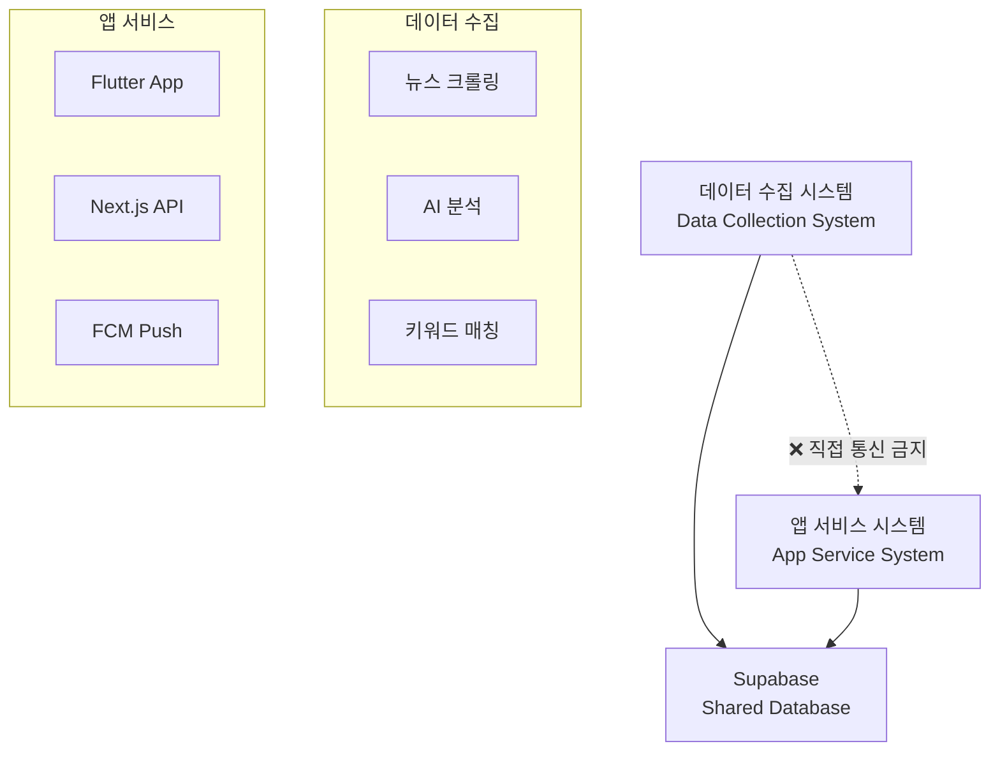
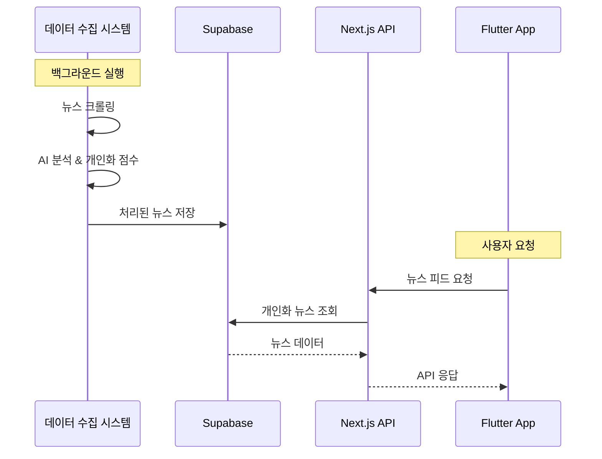
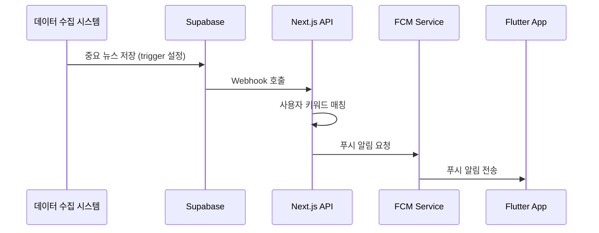

# 🏗️ InsightFlo 아키텍처 표준 가이드

**버전**: 1.0  
**최종 업데이트**: 2025-01-21  
**표준 수립자**: Standards Guardian  
**적용 범위**: 전체 개발 팀

---

## 📋 목차

1. [분리 아키텍처 원칙](#분리-아키텍처-원칙)
2. [시스템 구조](#시스템-구조)
3. [데이터 흐름](#데이터-흐름)
4. [장애 격리](#장애-격리)
5. [성능 요구사항](#성능-요구사항)

---

## 🎯 분리 아키텍처 원칙

### 핵심 원칙: **Complete System Separation**



### ✅ 준수 사항

1. **물리적 분리**: 별도 서버/컨테이너에서 독립 실행
2. **논리적 분리**: 코드베이스 완전 분리
3. **데이터 분리**: 공유 데이터베이스를 통한 간접 통신만 허용
4. **배포 분리**: 독립적인 배포 파이프라인

### 🚫 금지 사항

1. **직접 API 호출**: 데이터 수집 ↔ 앱 서비스 간 직접 통신 금지
2. **코드 공유**: 공통 모듈 공유 금지 (타입 정의 제외)
3. **동기 의존성**: 실시간 의존성 생성 금지
4. **단일 장애점**: 한 시스템 장애가 다른 시스템에 영향 금지

---

## 🏛️ 시스템 구조

### 1. 데이터 수집 시스템 (Background Service)

```yaml
책임 범위:
  - 외부 뉴스 소스에서 데이터 크롤링
  - AI를 통한 뉴스 분석 및 요약
  - 키워드 매칭 및 중요도 점수 계산
  - Supabase에 처리된 데이터 저장

기술 스택:
  - Language: Python/Node.js (자유 선택)
  - Database: Supabase PostgreSQL (읽기/쓰기)
  - Queue: Redis (선택사항)
  - Schedule: Cron/Task Queue

데이터 처리 흐름:
  1. 외부 API/RSS 뉴스 수집
  2. 텍스트 정제 및 중복 제거
  3. AI 분석 (감정, 요약, 키워드 추출)
  4. 사용자 키워드와 매칭하여 개인화 점수 계산
  5. Supabase에 최종 데이터 저장
```

### 2. 앱 서비스 시스템 (User-Facing)

#### Next.js API 서버
```typescript
책임 범위:
  - 사용자 인증 (JWT 기반)
  - Flutter 앱 API 제공
  - 개인화 뉴스 피드 조회
  - 사용자 설정 관리
  - FCM 푸시 알림 발송

구조:
app/
├── api/
│   ├── v1/                    // ✅ 필수: API 버전 관리
│   │   ├── auth/
│   │   │   ├── login/route.ts
│   │   │   ├── register/route.ts
│   │   │   └── refresh/route.ts
│   │   ├── news/
│   │   │   ├── feed/route.ts       // 개인화 피드
│   │   │   ├── search/route.ts     // 뉴스 검색
│   │   │   └── [id]/route.ts       // 뉴스 상세
│   │   ├── users/
│   │   │   ├── profile/route.ts
│   │   │   └── keywords/route.ts   // 키워드 관리
│   │   └── bookmarks/route.ts
│   └── health/route.ts        // 헬스 체크
├── middleware.ts              // JWT 검증
└── layout.tsx
```

#### Flutter 앱
```dart
책임 범위:
  - 사용자 UI/UX 제공
  - Next.js API와 통신
  - 로컬 데이터 캐싱 (Drift)
  - 푸시 알림 수신 및 처리

Clean Architecture 구조:
lib/
├── core/
│   ├── constants/
│   ├── errors/
│   ├── network/
│   └── utils/
├── features/
│   ├── auth/
│   │   ├── data/              // API 호출, 모델 변환
│   │   ├── domain/            // Entity, Repository 인터페이스
│   │   └── presentation/      // UI, State Management
│   ├── news/
│   ├── search/
│   └── profile/
└── shared/
    ├── widgets/
    └── providers/
```

---

## 🔄 데이터 흐름

### 1. 뉴스 데이터 처리 흐름



### 2. 실시간 알림 흐름



### 3. 데이터베이스 스키마 표준

#### 공유 테이블 (Shared Tables)
```sql
-- 뉴스 데이터 (데이터 수집 시스템이 생성)
news (
  id UUID PRIMARY KEY,
  title TEXT NOT NULL,
  content TEXT NOT NULL,
  summary TEXT NOT NULL,
  sentiment VARCHAR(10), -- 'positive', 'negative', 'neutral'
  keywords TEXT[], -- 추출된 키워드 배열
  source VARCHAR(100),
  published_at TIMESTAMP,
  created_at TIMESTAMP DEFAULT NOW()
);

-- 개인화 점수 (데이터 수집 시스템이 생성)
user_news_scores (
  id UUID PRIMARY KEY,
  user_id UUID REFERENCES users(id),
  news_id UUID REFERENCES news(id),
  relevance_score DECIMAL(3,2), -- 0.00 ~ 1.00
  created_at TIMESTAMP DEFAULT NOW()
);
```

#### 앱 전용 테이블 (App-Only Tables)
```sql
-- 사용자 데이터 (앱 서비스 시스템이 관리)
users (
  id UUID PRIMARY KEY,
  email VARCHAR(255) UNIQUE NOT NULL,
  password_hash TEXT NOT NULL,
  name VARCHAR(100),
  created_at TIMESTAMP DEFAULT NOW(),
  updated_at TIMESTAMP DEFAULT NOW()
);

-- 사용자 키워드 (앱 서비스 시스템이 관리)
user_keywords (
  id UUID PRIMARY KEY,
  user_id UUID REFERENCES users(id),
  keyword VARCHAR(50) NOT NULL,
  weight DECIMAL(3,2) DEFAULT 1.0,
  created_at TIMESTAMP DEFAULT NOW()
);
```

---

## 🛡️ 장애 격리

### 1. 시스템 독립성 보장

```yaml
데이터 수집 시스템 장애 시:
  영향: 신규 뉴스 업데이트 중단
  복구: 기존 뉴스 데이터로 서비스 계속 제공
  알림: 관리자에게만 장애 알림, 사용자는 인지 불가

앱 서비스 시스템 장애 시:
  영향: 사용자 서비스 중단
  복구: 데이터 수집은 계속 진행, 복구 후 최신 데이터 제공
  알림: 사용자에게 일시적 서비스 점검 안내
```

### 2. 헬스 체크 및 모니터링

```typescript
// Next.js API 헬스 체크
// app/api/health/route.ts
export async function GET() {
  const dbHealth = await checkDatabaseConnection();
  const cacheHealth = await checkRedisConnection();
  
  return Response.json({
    status: 'healthy',
    timestamp: new Date().toISOString(),
    services: {
      database: dbHealth ? 'up' : 'down',
      cache: cacheHealth ? 'up' : 'down'
    }
  });
}
```

### 3. Circuit Breaker 패턴

```dart
// Flutter에서 API 호출 시 Circuit Breaker 적용
class ApiClient {
  final CircuitBreaker _circuitBreaker = CircuitBreaker(
    failureThreshold: 5,
    timeout: Duration(minutes: 1),
    resetTimeout: Duration(minutes: 5),
  );
  
  Future<T> request<T>(String endpoint) async {
    return await _circuitBreaker.call(() async {
      return await _dio.get(endpoint);
    });
  }
}
```

---

## ⚡ 성능 요구사항

### 1. API 응답 시간 기준

```yaml
인증 API:
  - 로그인: < 200ms
  - 토큰 갱신: < 100ms
  - 회원가입: < 500ms

뉴스 API:
  - 피드 조회 (20개): < 300ms
  - 뉴스 검색: < 500ms
  - 뉴스 상세: < 150ms

사용자 API:
  - 프로필 조회: < 100ms
  - 키워드 관리: < 200ms
```

### 2. Flutter 앱 성능 기준

```yaml
앱 시작 성능:
  - 콜드 스타트: < 0.8초 (목표)
  - 웜 스타트: < 0.3초
  - 핫 스타트: < 0.1초

메모리 사용량:
  - 기본 실행: < 100MB
  - 최대 사용량: < 200MB
  - 메모리 누수: 0%

UI 성능:
  - 프레임 레이트: 60 FPS 유지
  - 애니메이션: 16ms 내 렌더링
  - 스크롤 성능: 끊김 없는 부드러운 스크롤
```

### 3. 데이터베이스 성능

```yaml
쿼리 성능:
  - 단순 조회: < 50ms
  - 조인 쿼리: < 100ms
  - 집계 쿼리: < 200ms
  - 전문 검색: < 300ms

연결 관리:
  - Connection Pool: 10-50 connections
  - Connection Timeout: 30초
  - Query Timeout: 10초

인덱싱 전략:
  - Primary Key: UUID (자동)
  - 외래 키: 모든 FK에 인덱스
  - 검색 필드: title, keywords에 GIN 인덱스
  - 정렬 필드: created_at, published_at
```

---

## 🚨 Standards Guardian 강제 규칙

### ✅ 의무 준수 사항

1. **분리 아키텍처 위반 시 즉시 거부**
2. **성능 기준 미달 시 배포 차단**
3. **데이터베이스 스키마 변경 시 사전 승인 필수**
4. **API 설계 표준 위반 시 코드 리뷰 거부**

### 📊 품질 게이트

```yaml
코드 머지 조건:
  - 아키텍처 표준 100% 준수
  - 성능 테스트 통과
  - 보안 검사 통과
  - Standards Guardian 승인
```

---

**Standards Guardian**: 🛡️ 아키텍처 표준 수호  
**Contact**: Standards Guardian 응답 파일로 문의  
**Authority**: ⚠️ 거부권 보유 - 표준 위반 시 작업 차단 권한