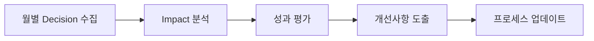

# Decision Protocol - 아키텍처 결정 표준

**파일 위치**: `management/contracts/standards/decision-protocol.md`  
**작성자**: Standards Guardian  
**작성일**: 2025-01-21  
**버전**: 1.0

---

## 📋 Architecture Decision Records (ADR) 표준

모든 중요한 아키텍처 결정은 ADR 형식으로 기록하고 `management/decisions/` 디렉토리에 저장합니다.

### ADR 파일명 형식
```
ADR-[번호]-[결정-제목-kebab-case].md
```

**예시**: `ADR-001-jwt-authentication-system.md`

### ADR 표준 템플릿

```markdown
# ADR-[번호]: [결정 제목]

**Date**: [YYYY-MM-DD]  
**Status**: Proposed | Accepted | Superseded | Deprecated  
**Deciders**: [결정 참여자 목록]  
**Technical Story**: [관련 이슈/요구사항 링크]

---

## Context
[결정이 필요한 상황과 배경 설명]
- 현재 상황
- 문제점 또는 요구사항
- 제약사항

## Decision Drivers
- [결정 요인 1]: [설명]
- [결정 요인 2]: [설명]
- [결정 요인 3]: [설명]

## Considered Options
- **Option 1**: [옵션명] - [간단한 설명]
- **Option 2**: [옵션명] - [간단한 설명]
- **Option 3**: [옵션명] - [간단한 설명]

## Decision Outcome
**Chosen option**: [선택된 옵션]

**Rationale**: [선택 이유]

### Consequences

**Good:**
- [긍정적 결과 1]
- [긍정적 결과 2]

**Bad:**
- [부정적 결과 1]
- [부정적 결과 2]

**Neutral:**
- [중립적 결과]

## Implementation
- [구현 방법]
- [마이그레이션 계획]
- [롤백 계획 (필요시)]

## Validation
- [ ] [검증 기준 1]
- [ ] [검증 기준 2]
- [ ] [검증 기준 3]

## Follow-up Actions
- [ ] [후속 작업 1] - 담당자: [이름] - 기한: [날짜]
- [ ] [후속 작업 2] - 담당자: [이름] - 기한: [날짜]

---
*Last updated*: [YYYY-MM-DD]  
*Next review*: [YYYY-MM-DD]
```

---

## 🏷️ 결정 분류 체계

### Priority Levels
| Level | 설명 | 예시 | 승인 권한 |
|-------|------|------|-----------|
| **CRITICAL** | 시스템 전체에 영향 | 아키텍처 변경, 기술 스택 변경 | Standards Guardian + PM |
| **MAJOR** | 모듈/서비스에 영향 | API 설계, 데이터 모델 변경 | Team Lead + Standards Guardian |
| **MINOR** | 팀 내부 영향 | 코딩 컨벤션, 도구 선택 | Team Lead |

### Decision Categories
| Category | 설명 | 담당자 |
|----------|------|--------|
| **Architecture** | 시스템 구조, 패턴 | Standards Guardian |
| **Technology** | 기술 스택, 라이브러리 | Standards Guardian + Team Lead |
| **Process** | 개발 프로세스, 워크플로우 | PM |
| **Quality** | 품질 기준, 테스트 전략 | QA + Standards Guardian |
| **Security** | 보안 정책, 인증/인가 | Standards Guardian |
| **Performance** | 성능 기준, 최적화 | Backend Lead + Standards Guardian |

### Status Lifecycle
```
Proposed → Under Review → Accepted → Implemented → Validated
    ↓           ↓            ↓           ↓
Rejected    Modified    Superseded   Deprecated
```

---

## 🚨 긴급 결정 프로세스

### 1. 긴급 상황 기준
- **Production 장애**: 즉시 대응 필요
- **보안 위협**: 24시간 내 해결 필요
- **Blocking Issue**: 팀 전체 작업 차단

### 2. 긴급 결정 절차
1. **즉시 대응**: 임시 해결책 적용
2. **24시간 내**: 긴급 ADR 작성 및 승인
3. **1주일 내**: 정식 ADR로 전환
4. **회고**: 긴급 상황 원인 분석 및 예방책 수립

---

## 📊 결정 추적 및 관리

### Decision Log 관리
- 모든 ADR은 번호순으로 관리
- `management/decisions/decision-log.md`에 목록 유지
- 월별 결정 현황 리포트 생성

### 결정 Impact 분석
- 각 결정의 영향 범위 문서화
- 관련 코드/시스템 매핑
- 롤백/변경 비용 평가

### Review 주기
- **CRITICAL**: 3개월마다 검토
- **MAJOR**: 6개월마다 검토
- **MINOR**: 1년마다 검토

---

## 🤝 결정 승인 프로세스

### 승인 매트릭스

| Decision Type | Proposer | Reviewers | Final Approver | Timeline |
|---------------|----------|-----------|----------------|----------|
| **CRITICAL** | Anyone | All Team Leads + Standards Guardian | Standards Guardian | 3-5 days |
| **MAJOR** | Team Lead | Standards Guardian + Related Teams | Standards Guardian | 2-3 days |
| **MINOR** | Team Member | Team Lead | Team Lead | 1 day |

### 승인 기준
1. **기술적 타당성**: 구현 가능성 및 유지보수성
2. **아키텍처 일관성**: 기존 표준과의 호환성
3. **비즈니스 가치**: 비용 대비 효과
4. **리스크 평가**: 잠재적 위험 요소
5. **팀 역량**: 구현 가능한 기술 수준

---

## 🔄 Decision Review Process

### 정기 리뷰 프로세스


### 성과 지표
- **Decision 준수율**: 결정 사항 이행 비율
- **변경 빈도**: 결정 변경/롤백 횟수
- **영향 정확도**: 예상 영향 vs 실제 영향
- **Timeline 준수**: 결정 일정 준수율

---

## 🛡️ Standards Guardian 권한

### 거부권 행사 기준
- 기존 아키텍처 표준 위반
- 보안 리스크 증가
- 성능 저하 우려
- 유지보수성 악화
- 기술 부채 증가

### 거부권 행사 프로세스
1. **명확한 근거 제시**: 위반 사항과 리스크 설명
2. **대안 제시**: 개선된 대안 방안 제안
3. **협의 기회**: 팀과 협의를 통한 해결책 모색
4. **최종 결정**: Standards Guardian 최종 판단

---

## 📈 Decision Quality Metrics

### 품질 평가 기준
- **명확성**: 결정 내용과 근거가 명확한가?
- **완전성**: 필요한 모든 정보가 포함되었는가?
- **추적가능성**: 구현과 검증이 추적 가능한가?
- **영향분석**: 영향 범위가 정확히 파악되었는가?

### 개선 지표
- ADR 작성 품질 향상
- 결정 변경/롤백 횟수 감소
- 팀 간 의사소통 효율성 증대
- 아키텍처 일관성 유지

---

**Standards Guardian Authority**: 🛡️ 모든 결정의 품질과 일관성 보장  
**Implementation Status**: ✅ 즉시 시행  
**Next Review**: 2025-04-21